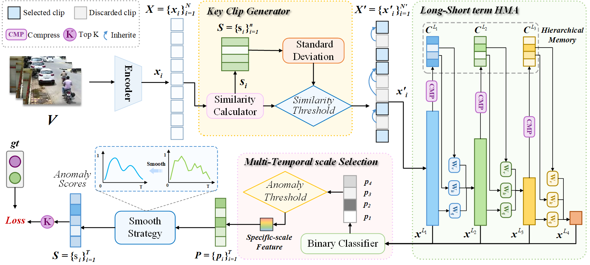

# LSHMA
This is the official repository of our paper:
**"Innovative Hierarchical Attention Memory Framework for Long-Short Term Video Anomaly Detection"** 


## Highlight
- We propose a innovative lightweight network capable of streaming the detection of anomalous behaviors at different temporal scales, with high efficiency and very low latency.

- We use Hierarchical Memory Attention (HMA) associates the input clips with cached historical segments to capture long-term behavioral features. The hierarchical memory allows the model to gain a broader temporal view as the network deepens. Benefit from this unique structure, our method can promptly detect short clips while also identifying long-term complex anomalies, without the need to wait for the collection of longer segments.

- We propose Key Clip Generator (KCG) to reduce redundant data in the input model. KCG is capable of streaming key segments by comparing temporal local and global similarities, and can dynamically adjust the thresholds according to the video situation itself.

- Experiments on the benchmark datasets XD-Violence and UCF-Crime validate the effectiveness of our method. Our approach demonstrates superior performance in detecting long-term complex anomalous behaviors while maintaining low computational complexity.
## Dataset
We use extracted CLIP features for UCF-Crime and XD-Violence datasets by [VadCLIP](https://github.com/nwpu-zxr/VadCLIP).  The features can be downloaded at [VadCLIP](https://github.com/nwpu-zxr/VadCLIP).


## Setup
To execute the code on your local setup, you will need to make the following adjustments to the files:
Update the file paths in `list/xd_CLIP_rgb.csv` `list/ucf_CLIP_rgb.csv` and `list/xd_CLIP_rgbtest.csv`  `list/ucf_CLIP_rgbtest.csv` to point to the locations where you have downloaded the datasets.
You have the flexibility to modify the hyperparameters as per your requirements in the file `xd_option.py` and `ucf_option.py`.
model can be donwload
## Training

Traing for XD-Violence dataset
```
python xd_train.py
```
Traing for UCF-Crime dataset
```
python ucf_train.py
```

## Testing

testing for XD-Violence dataset
```
python xd_test.py
```
testing for UCF-Crime dataset
```
python ucf_test.py
```
testing for long-short term dataset, Modify `test_list` path and `gt` path, run 
```
python ucf_test.py
```

## References
We referenced the repos below for the code. We thank them for their wonderful work！
* [MeMViT](https://github.com/facebookresearch/MeMViT)
* [VadCLIP](https://github.com/nwpu-zxr/VadCLIP)

## Citation
```bibtex
@article{
    
}

```
---
